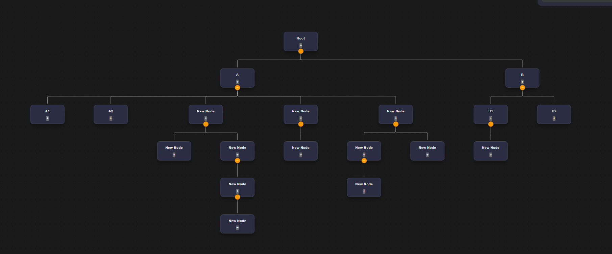

# Visual Tree Engine

A high-performance, interactive tree-structure visualizer built with **React** and **React Flow**. This project implements a custom layout engine to render hierarchical data with clean spacing and intuitive parent-child relationships.

## 🚀 Features
- **Custom Layout Algorithm**: Implements a recursive midpoint positioning logic to ensure parents are perfectly centered above children without node overlap.
- **Dynamic Interactions**: Support for expanding/collapsing subtrees and adding new nodes in real-time.
- **Bonus - Search & Highlight**: Instantly locate and highlight specific nodes across the hierarchy.
- **Bonus - Reactive Viewport**: Automatically pans and zooms to fit the tree structure using `fitView` with smooth transitions.

## 🛠️ Technical Stack
- **Frontend**: React.js, React Flow
- **State Management**: React Hooks (useState, useMemo, useCallback)
- **Styling**: CSS3 (Custom Dark Theme)
- **Bundler**: Vite

## 🧠 The Algorithm
Instead of using standard graph libraries, I developed a **Two-Pass Recursive DFS Algorithm**:
1. **Bottom-Up Pass**: Calculates the cumulative width required by each subtree to prevent sibling overlap.
2. **Top-Down Pass**: Assigns Cartesian coordinates $(x, y)$ while centering each parent at the mathematical average of its children's positions.

## 📦 Setup & Installation
1. Clone the repository: `git clone https://github.com/your-username/visual-tree-engine.git`
2. Install dependencies: `npm install`
3. Start the development server: `npm run dev`

## Demo ScreenShots

